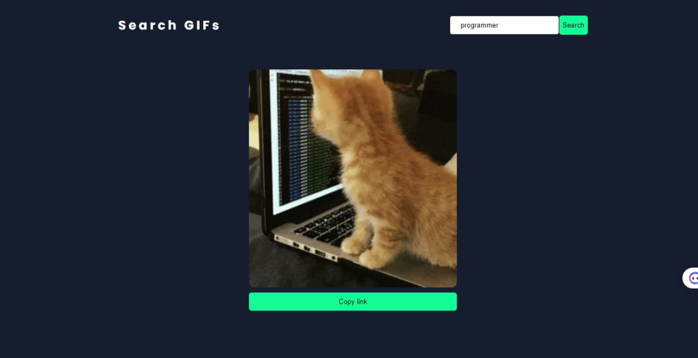

# API Homework

This project is a simple example provided during the lesson on **[async and await](https://www.theodinproject.com/lessons/node-path-javascript-async-and-await)**. It involves working with APIs, promises, and async/await functions.

## Screenshot

## Link

[Live Site](https://mahmoodhashem.github.io/The_Odin_Projects/JavaScript-exercises/giphy/index.html "GO to page")

## Introduction

The purpose of this homework is to practice using async and await in JavaScript by interacting with an API. This exercise helps in understanding how to handle asynchronous operations and promises effectively.

## Objectives

- Learn how to use async and await for asynchronous operations.
- Understand how to handle promises.
- Gain experience in working with APIs.

## Technologies Used

- JavaScript (ES6+)
- API of [Giphy ](https://developers.giphy.com/)
