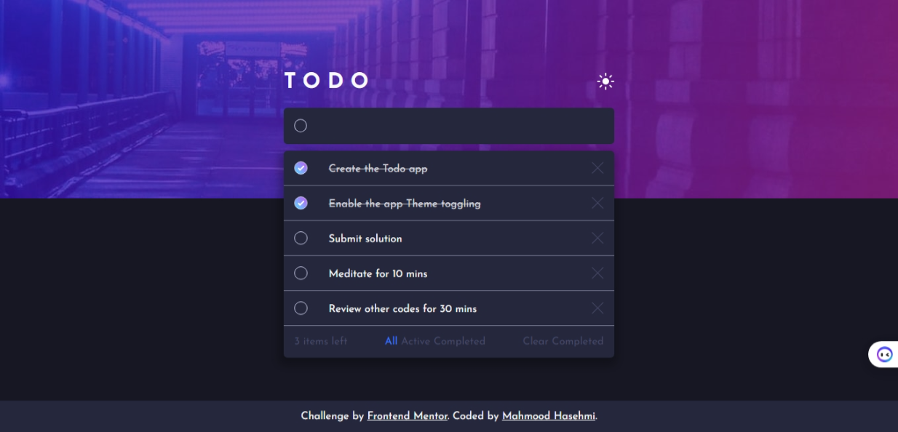

### Screenshot

### Links

- [Solution URL](https://github.com/MahmoodHashem/The_Odin_Projects/tree/main/JavaScript-exercises/todo-app)
- [Live Site URL](https://mahmoodhashem.github.io/The_Odin_Projects/JavaScript-exercises/todo-app/index.html)

### Useful resources

- 🎥 [Web Dev Simplified Video](https://www.youtube.com/watch?v=W7FaYfuwu70) This video was instrumental in helping me grasp the main structure of a Todo app! 📝
- 🎬 [Kevin Powell Video](https://www.youtube.com/watch?v=IhmSidOJSeE&t=0s) A fantastic resource for customizing the checkbox and enhancing the form section. Perfect for elevating your project
- [light-dark()](https://developer.mozilla.org/en-US/docs/Web/CSS/color_value/light-dark) CSS color function: This enables setting two colors for a property - returning one of the two colors options by detecting if the developer has set a light or dark color scheme or the user has requested light or dark color theme......
- [color-scheme](https://developer.mozilla.org/en-US/docs/Web/CSS/color-scheme) : The **`color-scheme`** [CSS](https://developer.mozilla.org/en-US/docs/Web/CSS) property allows an element to indicate which color schemes it can comfortably be rendered in.

## Author

- [My Portfolio](https://main--mahmood-hashemi.netlify.app/)
- [Twitter](https://twitter.com/Mahmood18999963)
- [LinkedIn](https://www.linkedin.com/in/shah-mahmood-hashemi-55172a276/)

## Acknowledgments

I would like to express my gratitude to all content creators, bloggers, and senior developers who have generously made learning web development accessible and free for us.
