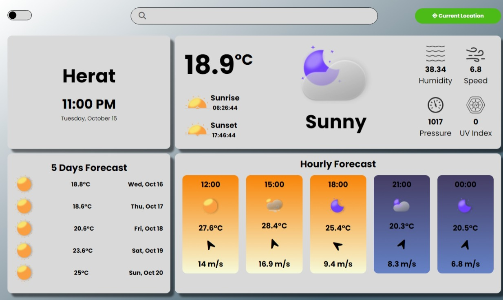

# Weather App

Welcome to the Weather App! This application provides real-time weather information for any location around the world, utilizing the [Visual Crossing Weather API](https://www.visualcrossing.com/). Built with vanilla JavaScript, it offers a clean and user-friendly interface to access a variety of weather data.

## Screenshot
    

## Features

- **Current Weather Data**: Displays the city name, current temperature, humidity, wind speed, UV index, sunrise and sunset times, and current weather conditions.
- **5-Day Forecast**: Provides a detailed daily forecast for the next five days, including temperature and weather conditions.
- **Hourly Forecast**: Shows the weather for specific hours of the day.
- **Geolocation Support**: Automatically fetches weather data based on the user's current location.
- **Responsive Design**: Optimized for both mobile and desktop viewing.

## Technologies Used

- HTML
- CSS
- JavaScript (ES6)
- Fetch API for network requests
- Visual Crossing Weather API for weather data
- OpenCage Geocoding API for location data

## How It Works

1. **User Input**: Users can enter a city name to fetch its weather data. The app also retrieves the user's current location automatically on load.
2. **API Calls**: The app makes API calls to fetch weather data based on the city or geolocation coordinates.
3. **Data Display**: The app updates the UI with the retrieved weather data, including current conditions, forecasts, and icons representing the weather.

## File Structure

```
/images
/index.html
/styles/
    mediaqueries.css
    style.css
/js/
  api.js          # Handles API requests
  geo.js          # Manages geolocation functions
  main.js         # Main application logic
  ui.js           # Updates the UI with weather data
  utils.js        # Utility functions for date and time formatting
```
