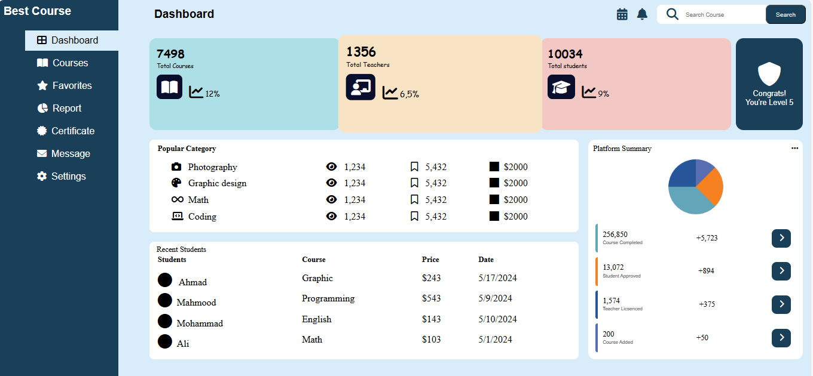

Time Spent on this Repository:

# The Odin Project Assignments

This repository contains my personal projects and assignments completed through [The Odin Project](https://www.theodinproject.com/), a comprehensive curriculum for learning Full Stack Web Development.

## Projects

Here are some of the projects I've completed as part of The Odin Project curriculum:

### Rock Paper Scissors

    

- **Technologies Used**: HTML, CSS, JavaScript
- **[Live Site](https://mahmoodhashem.github.io/The_Odin_Projects/JavaScript-exercises/rock-paper-scissors/index.hmlt)**
- **[Repo](https://github.com/MahmoodHashem/The_Odin_Projects/tree/main/JavaScript-exercises/rock-paper-scissors)**

### Calculator

    

- **Technologies Used**: HTML, CSS, JavaScript
- **[Live Site](https://mahmoodhashem.github.io/The_Odin_Projects/JavaScript-exercises/calculator/index.html)**
- **[Repo](https://github.com/MahmoodHashem/The_Odin_Projects/tree/main/JavaScript-exercises/calculator)**

### Form Validation

    

- **Technologies Used**: HTML, CSS, JavaScript
- **[Live Site](https://mahmoodhashem.github.io/The_Odin_Projects/JavaScript-exercises/form/index.html)**
- **[Repo](https://github.com/MahmoodHashem/The_Odin_Projects/tree/main/JavaScript-exercises/form)**

### Dashboard

- **Technologies Used**: HTML, CSS, JavaScript
- **[Live Site](https://mahmoodhashem.github.io/The_Odin_Projects/JavaScript-exercises/course-dashbord/index.html)**
- **[Repo](https://github.com/MahmoodHashem/The_Odin_Projects/tree/main/JavaScript-exercises/course-dashbord)**

### Library

- **Technologies Used**: HTML, CSS, JavaScript
- **[Live Site](https://mahmoodhashem.github.io/The_Odin_Projects/JavaScript-exercises/library/index.html)**
- **[Repo](https://github.com/MahmoodHashem/The_Odin_Projects/tree/main/JavaScript-exercises/library)**

### Tic Tac Toe

- **Technologies Used**: HTML, CSS, JavaScript
- **[Live Site](https://mahmoodhashem.github.io/The_Odin_Projects/JavaScript-exercises/tictactoe/index.html)**
- **[Repo](https://github.com/MahmoodHashem/The_Odin_Projects/tree/main/JavaScript-exercises/tictactoe)**

### Restaurant page

    

- **Technologies Used**: HTML, CSS, JavaScript, Webpack
- **[Live Site](https://mahmoodhashem.github.io/The_Odin_Projects/JavaScript-exercises/Restaurant-page/dist/index.html)**
- **[Repo](https://github.com/MahmoodHashem/The_Odin_Projects/tree/main/JavaScript-exercises/Restaurant-page)**

### Todo List

- **Technologies Used**: HTML, CSS, JavaScript
- **[Live Site](https://mahmoodhashem.github.io/The_Odin_Projects/JavaScript-exercises/todo-app/index.html)**
- **[Repo](https://github.com/MahmoodHashem/The_Odin_Projects/tree/main/JavaScript-exercises/todo-app)**

### Weather App

- **Technologies Used**: HTML, CSS, JavaScript
- **[Live Site](https://mahmoodhashem.github.io/The_Odin_Projects/JavaScript-exercises/weather-app/index.html)**
- **[Repo](https://github.com/MahmoodHashem/The_Odin_Projects/tree/main/JavaScript-exercises/weather-app)**

### Hashmap Data Structure

- **Technologies Used**: HTML, CSS, JavaScript
- **[Live Site](https://mahmoodhashem.github.io/The_Odin_Projects/JavaScript-exercises/hashMap/index.html)**
- **[Repo](https://github.com/MahmoodHashem/The_Odin_Projects/tree/main/JavaScript-exercises/hashMap)**

### BST (Binary Search Tree)

- **Technologies Used**: HTML, CSS, JavaScript
- **[Live Site](https://mahmoodhashem.github.io/The_Odin_Projects/JavaScript-exercises/bst/index.html)**
- **[Repo](https://github.com/MahmoodHashem/The_Odin_Projects/tree/main/JavaScript-exercises/bst)**

### Knights Travails

- **Technologies Used**: HTML, CSS, JavaScript
- **[Live Site](https://mahmoodhashem.github.io/The_Odin_Projects/JavaScript-exercises/knight-travails/index.html)**
- **[Repo](https://github.com/MahmoodHashem/The_Odin_Projects/tree/main/JavaScript-exercises/knight-travails)**

### Contributing

Feel free to fork this repository and submit pull requests to contribute to these projects. You can also open issues to discuss potential improvements or any bugs you find.

### Contact

If you have any questions, feel free to [contact me](mailto:shmahmoodham143@gmail.com).
---------------------------------------------------
